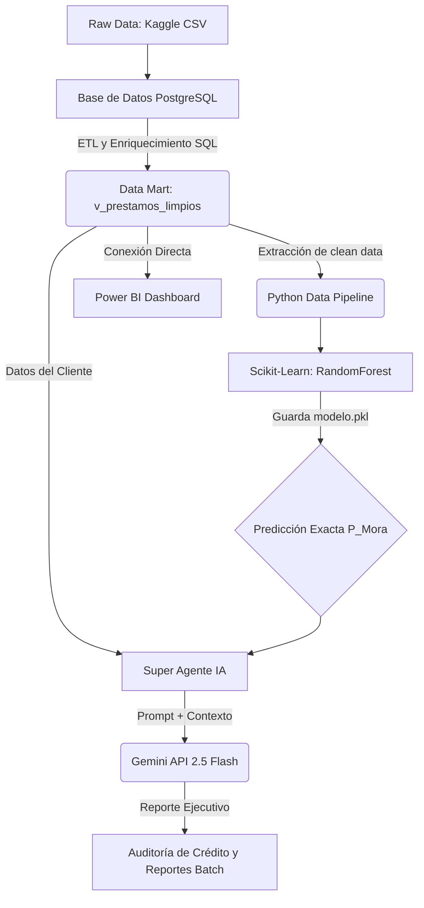

# Credit Risk AI Agent & Machine Learning Pipeline

Este proyecto implementa una solución *End-to-End* de predicción y análisis de Riesgo Crediticio. Combina extracción de datos SQL, ingeniería de datos (ETL), entrenamiento de un modelo de Machine Learning (Random Forest) para la predicción de mora, un motor Generativo con Inteligencia Artificial (Google Gemini) para la justificación de decisiones en lenguaje natural de negocio, y visualización en Power BI.

**📊 Fuente de Datos:** El dataset original proviene de Kaggle: [Credit Risk Dataset](https://www.kaggle.com/datasets/laotse/credit-risk-dataset).

## 🏗 Arquitectura del Sistema



## 🗄️ Data Engineering y ETL (PostgreSQL)

Todo el procesamiento inicial de datos, limpieza y enriquecimiento ocurre directamente en la base de datos para máxima eficiencia y seguridad. Esto se encuentra documentado en `sql/00_setup_and_transformation.sql`:

1. **Ingesta:** Creación de la tabla `prestamos` basada en la estructura del dataset de Kaggle.
2. **Enriquecimiento (Feature Engineering):** 
   - *Ciberseguridad:* Anonimización estricta de IDs de clientes utilizando Hashing MD5 para cumplir normativas de Habeas Data.
   - *Geointeligencia:* Asignación simulada de departamentos en Colombia para permitir filtros y perfiles demográficos.
   - *Estacionalidad:* Generación de fechas de desembolso para el ciclo 2024-2025 para el análisis de series de tiempo.
3. **Capa de Consumo (`v_prestamos_limpios`):** Una vista SQL que transforma los datos financieros de USD a COP utilizando tipos de datos masivos (`BIGINT`) para evitar desbordamientos, filtra los *outliers* de edad y experiencia laboral, y traduce categóricamente la información para el consumo directo en Power BI y Python.

## 🛠 Requisitos y Configuración Inicial

1. Clona el repositorio y asegúrate de tener Python 3.9+ instalado.
2. Crea el archivo `.env` basado en la plantilla de credenciales y agrega tu `GEMINI_API_KEY` personal.
3. Instala las dependencias de Python:
   ```bash
   pip install -r requirements.txt
   ```
4. Ejecuta el archivo `sql/00_setup_and_transformation.sql` en tu gestor PostgreSQL para construir la base de datos.

## 📂 Archivos y Estructura Refactorizada de IA
* `00_test_db_connection.py`: Script para probar que la conexión por la URI de base de datos a PostgreSQL sea correcta.
* `01_train_model.py`: Entrena el modelo Random Forest. Imprime **Accuracy**, **Classification Report** y **Confusion Matrix**, y exporta a disco el `modelo_riesgo_final.pkl`.
* `02_single_report_generator.py`: Genera un perfilado de riesgo utilizando únicamente Gemini en base a la vista limpia.
* `03_batch_report_generator.py`: Script pesado que exporta 10 reportes asíncronos en txt a la carpeta `Reportes_Clientes/`.
* `04_risk_assessment_agent.py`: **El motor principal.** Integra el `modelo_riesgo_final.pkl` con datos tabulares en crudo para entregar a Gemini la probabilidad matemática de mora para justificación ejecutiva cruzada en texto plano.
