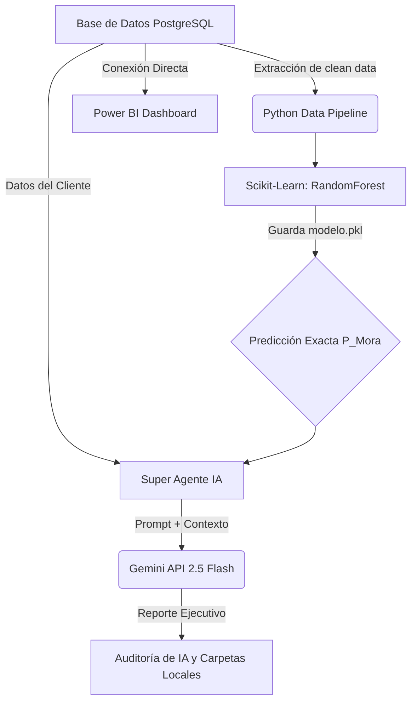

# Credit Risk AI Agent & Machine Learning Pipeline

Este proyecto implementa una solución *End-to-End* de predicción y análisis de Riesgo Crediticio. Combina extracción de datos SQL, entrenamiento de un modelo de Machine Learning (Random Forest) para la predicción de mora, un motor Generativo con Inteligencia Artificial (Google Gemini) para justificación de decisiones en lenguaje natural de negocio, y visualización en Power BI.

## 🏗 Arquitectura del Sistema



## 🛠 Requisitos y Configuración Inicial

1. Clona el repositorio y asegúrate de tener Python 3.9+ instalado.
2. Crea el archivo `.env` basado en la plantilla de credenciales y agrega tu `GEMINI_API_KEY` personal.
3. Instala las dependencias:
   ```bash
   pip install -r requirements.txt
   ```

## 📂 Archivos y Estructura Refactorizada
* `00_test_db_connection.py`: Script para probar que la conexión por la URI de base de datos a PostgreSQL sea correcta.
* `01_train_model.py`: Entrena el modelo Random Forest. Imprime **Accuracy**, **Classification Report** y **Confusion Matrix**, y exporta a disco el `modelo_riesgo_final.pkl`.
* `02_single_report_generator.py`: Genera de un caso de riesgo utilizando únicamente Gemini con base a la BD.
* `03_batch_report_generator.py`: Script pesado que exporta 10 reportes asíncronos en txt a la carpeta `Reportes_Clientes/`.
* `04_risk_assessment_agent.py`: **El motor principal.** Integra el `modelo_riesgo_final.pkl` con datos en crudo para entregar a Gemini la probabilidad matemática de mora para justificación ejecutiva en texto plano.

## 📊 Vistas y Tablas de Base de Datos (SQL Server/PostgreSQL)

Se aplicó la siguiente transformación a esquema tipo estrella (data mart limpios):

```sql
CREATE VIEW v_prestamos_limpios AS
SELECT 
    cliente_hash AS id_cliente_anonimizado,
    departamento_colombia AS departamento,
    fecha_desembolso,
    person_age AS edad,
    -- Usamos CAST para convertir a BIGINT y evitar el error de rango
    CAST(person_income AS BIGINT) * 4000 AS ingresos_anuales_cop, 
    CAST(loan_amnt AS BIGINT) * 4000 AS monto_prestamo_cop,
    CASE 
        WHEN person_home_ownership = 'RENT' THEN 'Renta'
        WHEN person_home_ownership = 'MORTGAGE' THEN 'Hipoteca'
        WHEN person_home_ownership = 'OWN' THEN 'Propio'
        ELSE 'Otro'
    END AS tipo_vivienda,
    person_emp_length AS años_experiencia,
    CASE 
        WHEN loan_intent = 'PERSONAL' THEN 'Personal'
        -- ... Resto de homologación
    END AS motivo_prestamo,
    loan_grade AS categoria_riesgo,
    loan_int_rate AS tasa_interes,
    CASE 
        WHEN loan_status = 1 THEN 'Moroso'
        ELSE 'Al día'
    END AS estado_pago,
    loan_percent_income AS porcentaje_ingreso_prestamo,
    cb_person_cred_hist_length AS años_historial_crediticio
FROM prestamos
WHERE person_age <= 90 
  AND person_emp_length <= 60
  AND loan_int_rate IS NOT NULL;
```
